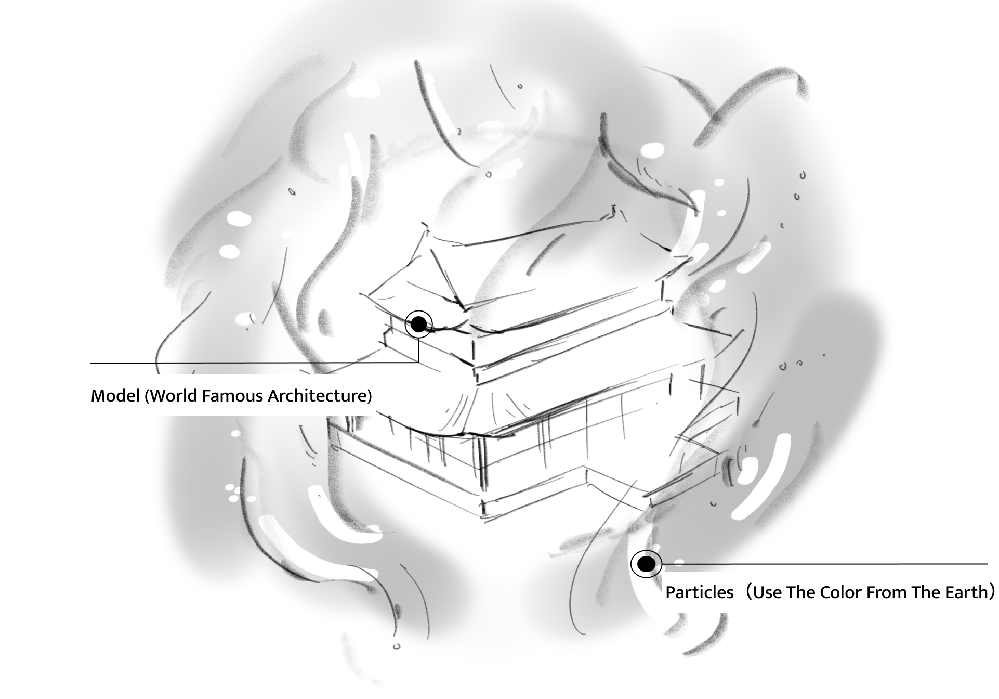

# Portfolio Website Brief - Ziyi Yuan

## 目标
- 为 Ziyi Yuan 制作个人作品集网站，主要给 NYU ITP 老师、合作方和实习申请场景查看。
- 网站部署到 GitHub Pages。
- 当前项目基于纯 `HTML + CSS + 少量 JS`，不使用前端框架。

## 身份
Ziyi Yuan (Tiffany) - Interactive Media Artist, NYU ITP MPS student

## Bio
Ziyi Yuan is an interactive media artist currently pursuing an MPS at NYU ITP.
Her work investigates the tension between technology and the human body,
using real-time interaction, generative visuals, and physical installation
to explore identity, surveillance, and emotional experience.

Tools: TouchDesigner / Python / Arduino / Unity / Blender

---

## 首页与整体结构

### 当前方向
- 首页不是“一个可以一直向下滚动的单页 landing page”。
- 首页应作为一个独立入口页面存在，视觉上像目录 / portal。
- 用户在首页点击不同图片或入口后，再跳转到对应页面。

### 首页交互要求
- 首页默认不允许继续向下滑看到 About Me、Installation Works、Other Works 等后续模块。
- 首页只展示首屏内容，并承担导航功能。
- 首页中的图片需要作为可点击入口，点击后跳转到对应页面。
- 后续会新增一个专门放首页图片的文件夹，开发时需要预留该资源目录。
- 首页中右侧或边缘导航文字如果保留，作用应是“跳转到别的页面 / section 页面”，而不是同页滚动锚点。

### 页面拆分建议
- `index.html`: 首页 / Portal，只保留首屏和点击跳转入口。
- `about.html` 或独立 About 页面：承接 About Me 内容。
- `installation-works.html` 或独立作品列表页面：承接 Installation Works。
- `other-works.html` 或独立作品列表页面：承接 Other Works。
- 作品详情页继续保持每个项目一个单独 HTML 文件。

如果实际开发中仍希望把某些内容放在 `index.html`，也必须保证首页首屏本身不形成长页面滚动体验。

---

## 版式要求

### 关键要求
- 页面排版必须以 Figma 稿为最高优先级，不要自行改成更“常规网页”的流式排版。
- 目前 Claude Code 做出的版本和原始排版不一致，需要回到 Figma 重新对齐。
- 特别是首页首屏、About Me 区块、文字位置、图片裁切关系，都要按 Figma 校正。

### 这次必须修正的问题
- 首页当前被做成了可直接下滑的长页面，这一版需要废弃。
- About Me 的图片不能被吃掉、裁掉或被别的层覆盖。
- About Me 相关文字的位置目前不对，需要按 Figma 的位置、比例和留白重新摆放。
- Installation Works 和 Other Works 的排版关系也需要重新参考 Figma，而不是自动平均分配。

### Figma 参考
- 设计链接：
  [Figma 文件](https://www.figma.com/design/aTv178qBrQFUAlI6ISZ6YC/%E8%A2%81%E6%A2%93%E7%A5%8E%E9%A1%B9%E7%9B%AE%E4%B8%80?node-id=1762-589&t=jWnDABtG3SVFOAYS-4)
- File key: `aTv178qBrQFUAlI6ISZ6YC`

| Frame | 内容 | Node ID |
|---|---|---|
| Frame 1 | Hero / 首页首屏 | `1762:589` |
| Frame 2 | About Me | `1765:611` |
| Frame 3 | Installation Works Grid | `1766:818` |
| Frame 4 | 详情页 - 全屏视频封面 | `1770:185` |
| Frame 5 | 详情页 - 项目介绍 + 截图 | `1770:611` |
| Frame 6 | 详情页 - Process | `1770:626` |

---

## 视觉风格
- 风格：Glitch Brutalism / Terminal Brutalism
- 背景色：`#eaeaea`
- 主色：黑白为主，红色作为 accent
- 字体：`Space Grotesk` + `Courier New`
- 保留元素：1px 黑色线框、旋转文字导航、`#001` 编号风格、右下角标签感

### 特效图层规则
- 所有红色 glitch 效果、ERR 方块、报错感动画都必须放在页面最底层。
- 这些红色特效只能作为背景氛围，不能压在图片和正文文字上方。
- 图片、标题、正文、导航文字的层级都必须高于 glitch 特效层。
- 即使保留 `pointer-events: none`，视觉层级也不能浮到内容前面。

---

## 技术要求
- 纯 `HTML + CSS + 少量 JS`，不使用框架。
- 支持 GitHub Pages 部署。
- 作品详情页视频仍使用 `iframe` 嵌入。
- YouTube 优先，Bilibili 备选。
- iframe 样式：`width: 100%`, `height: 100vh`, `border: none`。

---

## 作品详情页结构

每个作品一个单独 HTML 文件，例如：
- `echoes-of-nature.html`
- `identity-code.html`
- `physical-exam.html`

每个详情页结构：
- Section 1: 全屏视频封面，左下角大标题。
- Section 2: 作品标题 + 项目介绍文字。
- Section 3: 项目截图展示。
- Section 4: Process 图片与对应文字说明。

---

## 图片排版规则

### 基本原则
- 图片之间尽量无缝排列，`gap: 0`。
- 页面边缘与图片边缘尽量齐平，避免额外 padding / margin。
- 图片按版面比例自适应，但不要随意裁掉主体内容。
- 宽图可独占一整行。

### 截图区 Section 3
- 默认 2 列等宽。
- 宽图可 `grid-column: span 2`。
- 如果只有 3 张图，可以单独处理成 3 列。
- 最终排版仍以实际图片比例和 Figma 观感为准，不机械套版。

### Process 区 Section 4
- 每张 Process 图下方紧跟对应文字说明。
- 文本区域建议 `padding: 24px 32px`。
- 文字风格延续 `Space Grotesk` 轻字重。
- 默认 2 列，宽图可占整行。

示例结构：

```html
<div class="process-item">
  
  <div class="process-caption">介绍文字写在这里</div>
</div>
```

---

## glitch-bg.js 说明

项目中已有 `glitch-bg.js`，默认直接引用，不建议改动其核心视觉逻辑。

每个 HTML 文件在 `</body>` 前加入：

```html
<script src="glitch-bg.js"></script>
```

如果页面在子目录，再改成对应相对路径。

### 本轮补充要求
- 如果现有效果层级导致它覆盖正文内容，需要通过页面容器层级、canvas z-index、内容层 z-index 等方式修正。
- 原则是“保留 glitch 效果，但必须沉到底层背景”。

---

## 视频资源清单

| 作品 | 平台 | 链接 |
|---|---|---|
| Echoes of Nature | YouTube / Bilibili | https://youtu.be/vAEdD9HzrGg |
| Identity Code | YouTube / Bilibili | https://youtu.be/9vPoCaPPTrQ |
| Physical Exam | YouTube / Bilibili | https://youtu.be/6L28Tyyo2Yw |
| Nexus | YouTube / Bilibili | https://youtu.be/HIs6Eoi1hgk |

YouTube embed 格式：

```text
https://www.youtube.com/embed/VIDEO_ID?autoplay=1&mute=1&loop=1&controls=0&playlist=VIDEO_ID
```

Bilibili embed 格式：

```text
https://player.bilibili.com/player.html?bvid=BVxxxx&autoplay=1&muted=1
```

---

## 图片资源目录

所有图片存放在 `assets/images/` 下。

### 当前已存在目录
- `assets/images/works/`
- `assets/images/echoes_of_nature/`
- `assets/images/identity_code/`
- `assets/images/physical_exam/`
- `assets/images/other/`
- `assets/images/nexus/`

### 首页图片目录
- 需要新增一个专门存放首页图片的文件夹。
- 建议目录：`assets/images/home/`
- 首页首屏所用图片、可点击入口图、首页专属视觉图都放在这里。

### 当前首页封面图
- `assets/images/works/echoes_cover.png`
- `assets/images/works/identity_code_cover.png`
- `assets/images/works/nexus_cover.png`
- `assets/images/works/physical_exam.jpg`

### 资源命名建议
- 文件名统一小写。
- 目前项目实际目录多使用下划线命名，应优先保持和现有资源一致。
- 新增文件不要混用多套命名规则。

如果图片还未准备好，可以先用占位块，但要明确标注未来资源路径。

---

## 文件结构概览

```text
ziyi-portfolio/
├── index.html
├── echoes-of-nature.html
├── identity-code.html
├── physical-exam.html
├── style.css
├── glitch-bg.js
├── BRIEF.md
└── assets/
    └── images/
        ├── home/                # 预留：首页图片目录
        ├── works/
        ├── echoes_of_nature/
        ├── identity_code/
        ├── physical_exam/
        ├── other/
        └── nexus/
```

---

## 本轮需求总结
- 把首页从“可下滑长页面”改成“首屏入口页”。
- 首页点击不同图片后跳转到不同页面，而不是在首页继续往下滚动。
- 按 Figma 重新对齐首页和 About Me 的排版。
- 修复 About Me 图片被吃掉、文字位置不正确的问题。
- 红色 glitch / ERR / 报错特效全部下沉到底层背景，不能盖住图片和文字。
- 在 `BRIEF.md` 中明确新增首页图片文件夹需求。
